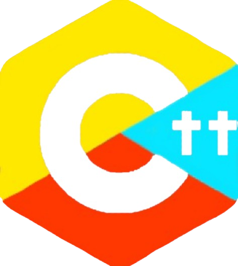

# DivineC

DivineC is my own Esoteric Programming Language inspired by Terry A. Davis's HolyC-lang. DivineC is a form of extension to HolyC lang such as C++ to C, yet with "more holyness" and references to the Bible and Testaments.

**_please dont hate me for this abomination_**

## **"Let There Be Code!"**

A sacred programming language with divine syntax and spiritual keywords.
Write blessed code using divine keywords like `let there be`, `sacred`, `blessed`, `pray`, and `forgive`.

## Features

- **Divine Syntax** - Spiritual keywords that make coding feel sacred.
- **Dual Implementation** - Both C interpreter and web-based runner.
- **Interactive Web IDE** - Run DivineC in your browser.
- **Beautiful (lol) Interface** - Elegant design and divine aesthetics that will give you goosebumps.

## Quick Start

The easiest way to try DivineC right now is through the website:

[GitHub Pages link](https://asmagaa.github.io/DivineC-lang/)

# DISCLAIMER

**IMPORTANT: This project is intended as lighthearted programming satire and educational content only.**

As a believer and a respectful programmer myself, I want to be absolutely clear that:

- **This is NOT meant to mock or disrespect any religion, faith, or spiritual beliefs**,
- **This project is purely satirical/parody in nature** - inspired by the programming language community's tradition of creating esoteric and humorous languages,
- **All religious references are used with respect and humor**, not to trivialize or diminish the importance of faith,
- **This is a programming exercise and creative project**, not a statement about religion or spirituality,
- **I deeply respect all faiths and belief systems** - this project comes from a place of appreciation for the creativity and passion of the programming community.

**✨ May your code be blessed and bug-free! ✨**
